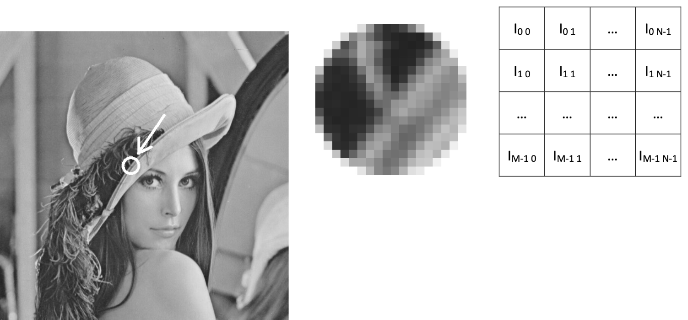

# Chapter 8: Speedup Your Program 

## 8.1 C and C++ with ARM

### Intel vs ARM

- With the help of C/C++ compilers, C and C++ are platform independent.
- But we need to know some background information on different CPUs.
- Intel achieved a dominant position the personal computer market. But recently ...

<figure>


</figure>

### ARM

- ARM (previously an acronym for Advanced RISC Machine and originally Acorn RISC Machine) is a family of reduced instruction set computing (RISC) architectures for computer [processors](https://en.wikipedia.org/wiki/ARM_architecture).
- ARM is the most widely used instruction set architecture (ISA) and the ISA produced in the largest quantity.

<figure>


</figure>

### Raspberry Pi 4

> https://www.raspberrypi.org/

• Broadcom BCM2711, Quad core Cortex-A72 (ARM v8) 64-bit SoC @1.5GHz
• 2GB, 4GB or 8GB LPDDR4-3200 SDRAM (depending on model)
• 2.4 GHz and 5.0 GHz IEEE 802.11ac wireless, Bluetooth 5.0, BLE
• Gigabit Ethernet
• 2 USB 3.0 ports; 2 USB 2.0 ports.
• Raspberry Pi standard 40 pin GPIO header (fully backwards compatible with previous boards)
• 2 × micro-HDMI ports (up to 4kp60 supported)


### How to develop programs with ARM Development boards ?

**Almost the same** with an X86 PC with Linux OS.

- gcc/g++
- Makefile
- cmake

## 8.2 Speedup your program

### Principle for Programming

​													Simple is Beautiful !
​														    Short
​                                                                                                                   Simple
​                                                                                                                  Efficient

### Some Tips on Optimization

- Choose an appropriate algorithm
- Clear and simple code for the compiler to optimize
- Optimize code for memory
- Do not copy large memory
- No printf()/cout in loops, it's slow!
- Table lookup (sin(), cos() ...)
- SIMD, OpenMP (Before explain what's these two, look at an example below:)

### An example: libfacedetection

> https://github.com/ShiqiYu/libfacedetection/

- Face detection and facial landmark detection in 1600 lines of source code

  - facedetectcnn.h :
    - 400 lines
    - CNN APIs
  - facedetectcnn.cpp:
    - 900 lines
    - CNN function definitions
  - facedetectcnn-model.cpp:
    - 300 lines
    - Face detection model
  - facedetectcnn-int8data.cpp
    - CNN model parameters in static variables

  <figure>
  
  
  </figure>

### SIMD: Single instruction, multiple data

> https://software.intel.com/sites/landingpage/IntrinsicsGuide/

- Intel: MMX, SSE, SSE2, AVX, AVX2, AVX512
- ARM: NEON
- RISC-V: RVV(RISC-V Vector Extension)

### SIMD in OpenCV

- "Universal intrinsics" is a types and functions set intended to simplify vectorization of code on different platforms.
- https://docs.opencv.org/master/df/d91/group__core__hal__intrin.html
- 使用OpenCV中的universal intrinsics为算法提速(1)(2)(3)
  - https://mp.weixin.qq.com/s/_dFQ9lDu-qjd8AaiCxYjcQ
  - https://mp.weixin.qq.com/s/3UmDImwlQwGX50b1hvz_Zw
  - https://mp.weixin.qq.com/s/XtV2ZUwDq8sZ8HlzGDRaWA

### An Overview of OpenMP – Ruud van der Pas 

​	– Sun Microsystems https://www.openmp.org/wp-content/uploads/ntu-vanderpas.pdf


**Q:** Where should #pragma be? The 1st loop or the 2nd?

```c++
#include <omp.h>
#pragma omp parallel for
for (size_t i = 0; i < n; i++)
{
	//#pragma omp parallel for
	for (size_t j = 0; j < n; j++)
	{
		//...
	}
}
```


## 8.3 An example with SIMD and OpenMP

> matoperation.cpp
>
> matoperation.hpp
>
> main.cpp

### ARM Cloud Server

- Huawei ARM Cloud Server

- Kunpeng 920 (2 cores of many)

- RAM: 3GB

- openEuler Linux

  

### Functions for dot product

```c++
float dotproduct(const float *p1, const float * p2, size_t n);
float dotproduct_unloop(const float *p1, const float * p2, size_t n);
float dotproduct_avx2(const float *p1, const float * p2, size_t n);
float dotproduct_avx2_omp(const float *p1, const float * p2, size_t n);
float dotproduct_neon(const float *p1, const float * p2, size_t n);
float dotproduct_neon_omp(const float *p1, const float * p2, size_t n);
```


## 8.4 Avoid memory copy in OpenCV

### What's an image?



### CvMat struct

> modules/core/include/opencv2/core/types_c.h


### step in CvMat struct

- How many bytes for a row of Matrix 4(row)x3(col)?
  - Can be 3, 4, 8, and any other values >=3.
  - Memory alignment for SIMD

### ROI: Region of interest

- Mat A
  - rows=100
  - cols=100
  - step=100
  - data=0xABCDEF00
- Mat B
  - rows=100
  - cols=100
  - step=100
  - data=0xABCDEF00
- Mat C
  - rows=30
  - cols=28
  - step=100
  - data=0xABCE0698
