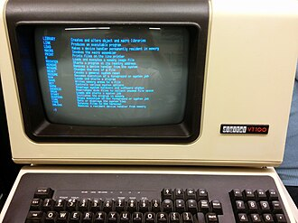

# 

# 9.4 const and static Members

## const Variables

- Statements for constants

  ```c++
  #define VALUE 100
  
  const int value = 100
  const int * p_int; // 不能透过指针修改指针指向的内容
  int const * p_int; // 不能透过指针修改指针指向的内容
  
  int * const p_int; // 指针指向的内容可以被修改，指针不能变
  
  /*
  *常用法：保证函数内的数据不变
  */
  void func(const int *); 
  void func(const int &);
  ```

## const Members

- `const` member variables behavior similar with normal const variables
- `const` member functions promise not to modify member variables.

```c++
class Student
{
    private:
    	const int BMI = 20;
    	// ..
    public:
    Student()
    {
        BMI = 19; // Can it be modified? No.
        // ...
    }
    int getBorn() const
    {
        born++; // Can it be modified?No.
        return born;
    }
}
```

## static Members

- **static** members are not bound to class instances.

  ```cpp
  // static.cpp
  class Student
  {
  private:
  static size_t student_total; // declaration only
  public:
  Student()
  {
  student_total++;
  }
  ~Student()
  {
  student_total--;
  }
  static size_t getTotal() {return student_total;}
  };
  // definition it here
  size_t Student::student_total = 0;
  ```

  

# Chapter 10: Advances in Classes

## 10.1 operator overloading

### Function overloading

```c++
Mat add(Mat& A, Mat& B);
Mat add(Mat& A, float b);
Mat add(float a, Mat& B);
Mat mul(Mat& A, Mat& B);
Mat mul(Mat& A, float b);
Mat mul(float a, Mat& B);
```

More convenient to code as follows:

```c++
Mat A, B;
float a, b;
//...
Mat C = A + B;
Mat D = A * B;
Mat E = a * A;
```

### Operator overloading

- Customizes the C++ operators for operands of user-defined types.

- Overloaded operators are functions with special function names:  *stringdemo.cpp*

  ```c++
  std::string s("Hello ");
  s += "C";
  s.operator+=(" and CPP!");
  ```

  

- Implementation of `operator+()` and `operator+=()`   *example1.cpp*

  ```cpp
  class MyTime
  {
  int hours;
  int minutes;
  public:
  MyTime(): hours(0), minutes(0){}
  MyTime(int h, int m): hours(h), minutes(m){}
  MyTime operator+(const MyTime & t) const
  {
  MyTime sum;
  sum.minutes = this->minutes + t.minutes;
  sum.hours = this->hours + t.hours;
  sum.hours += sum.minutes / 60;
  sum.minutes %= 60;
  return sum;
  }
  std::string getTime() const;
  ```

-  If one operand is not MyTime, and is an int

  ```cpp
  MyTime t1(2, 40);
  MyTime t2 = t1 + 20;
  ```

  The function can be:

  ```cpp
  MyTime operator+(int m) const
  {
  MyTime sum;
  sum.minutes = this->minutes + m;
  sum.hours = this->hours;
  sum.hours += sum.minutes / 60;
  sum.minutes %= 60;
  return sum;
  }
  ```

  

- We can even support the following operation to be more user friendly

  ```
  MyTime t1(2, 40);
  MyTime t2 = t1 + "one hour";
  ```

  see *example2.cpp*

- Overloaded operators is more user-friendly than functions.

- But , wait ..

  ```cpp
  t1 + 20; //operator
  t1.operator+(20); // equivalent function invoking
  ```

- How about the expression ?
  `20 + t1;`

## 10.2 friend Functions and << operator

 If we want that operator + can support `(int + MyTime)`
• Let a friend function to help
• Friend functions
Ø Declare in a class body
Ø Granted class access to members (including private members)
Ø But not members

## 10.3 Automatic Conversions and Type Casts for Classes

# Chapter 11: Dynamic Memory Management in Classes

## 11.1 Some Default Operations

### Default Constructors

Default Constructors

- Default constructor: a constructor which can be called without arguments

- If you define no constructors, the compiler automatically provide one 

  `MyTime::MyTime(){}`

-  If you define constructors, the compiler will not generate a default one

  ```c++
  class MyTime
  {
  public:
  MyTime(int n){ ... }
  };
  MyTime mt; //no appropriate constructor - Compilation failure
  ```

- To avoid ambiguous（混淆）

  ```cpp
  class MyTime
  {
  public: //two default constructors
  MyTime(){ ... }
  MyTime(int n = 0){ ... }
  };
  MyTime mt; // which constructor?- Compilation failure
  ```

### Implicitly-defined Destructor

-  If no destructor is defined, the compiler will generate an empty one.
  `MyTime::~MyTime(){}`
- Memory allocated in constructors is normally released in a destructor.
- However, the destructor that generated by compiler will not release memory automatically.

### Default Copy Constructors

- A copy constructor. Only one parameter, or the rest have default values

  `MyTime::MyTime(MyTime & t){ ... }`

  ```cpp
  MyTime t1(1, 59);
  MyTime t2(t1); //copy constructor
  MyTime t3 = t1; //copy constructor
  ```

- Default copy constructor:

  - If no user-defined copy constructors, the compiler will generate one.
  - Copy all non-static data members.

### Default Copy Assignment

- Assignment operators: =, +=, -=, ...

- Copy assignment operator 

  `MyTime & MyTime::operator=(MyTime & ){...}`

  ```cpp
  MyTime t1(1, 59);
  MyTime t2 = t1; //copy constructor
  t2 = t1; //copy assignment
  ```

- Default copy assignment operator

  - If no user-defined copy assignment constructors,
    the compiler will generate one.
  - Copy all non-static data members.

## 11.2 An example with dynamic memory

### A Simple String Class

```c++
class MyString
{
int buf_len;
char * characters;
public:
MyString(int buf_len = 64, const char * data = NULL)
{
this->buf_len = 0;
this->characters = NULL;
create(buf_len, data);
}
~MyString()
{
delete []this->characters;
}
// ...
};
```

### Dynamic Memory in Objects

```cpp
MyString str1(10, "Shenzhen");
MyString str2 = str1;
MyString str3;
str3 = str1;
```

**此处注意看讲解：**【快速学习C和C++，基础语法和优化策略，学了不再怕指针(南科大计算机系原版)】 【精准空降到 04:47】 https://www.bilibili.com/video/BV1Vf4y1P7pq/?p=48&share_source=copy_web&vd_source=ce7db4602809160957ede06f23353169&t=287

## 11.3 Solution1: Hard copy

> See: example2

### Copy Constructor

• Provide a user-defined copy constructor.

```cpp
MyString::MyString(const MyString & ms)
{
this->buf_len = 0;
this->characters = NULL;
create(ms.buf_len, ms.characters);
}
```

- `create()` release the current memory and allocate a new one .
- `this->characters` will not point to `ms.characters`.
- It's a hard copy!

### Copy Assignment

- Provide a user-defined copy assignment

  ```cpp
  MyString & operator=(const MyString &ms)
  {
  create(ms.buf_len, ms.characters);
  return *this;
  }
  ```

  

## 11.4 Solution2: Soft copy

### CvMat struct 

>  [modules/core/include/opencv2/core/types_c.h](modules/core/include/opencv2/core/types_c.h)

```cpp
typedef struct CvMat
{
    int type;
    int step;

    /* for internal use only */
    int* refcount;
    int hdr_refcount;

    union // union内指针共享内存（巧妙之处～
    {
        uchar* ptr;
        short* s;
        int* i;
        float* fl;
        double* db;
    } data;
```

|    ... | ...                               |
| -----: | --------------------------------- |
|    int | flags                             |
|    int | dims                              |
|    int | rows                              |
|    int | cols                              |
| uchar* | data                              |
|    int | refcount  // data被多少个对象引用 |
|    ... | ...                               |

### `cv::Mat class`

> 位置(20231012)：https://github.com/opencv/opencv/blob/7e17f01b7b43b756cb2d6a8b5c73548123b1fd74/modules/core/include/opencv2/core/mat.hpp#L810

`uchar* data` and `UMatData* u`  are allocated at the same time, `u`represents how many objects reference `data`.


### Solution in OpenCV

1. **modules/core/src/matrix.cpp**

> https://github.com/opencv/opencv/blob/7e17f01b7b43b756cb2d6a8b5c73548123b1fd74/modules/core/src/matrix.cpp#L484

- The allocated memory can be used by multiple object
- `Mat::u->refcount` is used to count the times the memory is referenced
- `CV_XADD`: macro for atomic add （怎么翻译-。-）

```cpp
Mat& Mat::operator=(const Mat& m)
{
    if( this != &m )
    {
        if( m.u ) // u就是 上面的 UMatData* u
            CV_XADD(&m.u->refcount, 1); // 引用次数+1，并考虑到了并行运算
        release();
        flags = m.flags;
        if( dims <= 2 && m.dims <= 2 )
        {
            dims = m.dims;
            rows = m.rows;
            cols = m.cols;
            step[0] = m.step[0];
            step[1] = m.step[1];
        }
        else
            copySize(m);
        data = m.data; // refcount+1，同时data赋值
        datastart = m.datastart;
        dataend = m.dataend;
        datalimit = m.datalimit;
        allocator = m.allocator;
        u = m.u;
    }
    return *this;
}
```

2. **Copy constructor of cv::Mat**

​	modules/core/src/matrix.cpp

> https://github.com/opencv/opencv/blob/7e17f01b7b43b756cb2d6a8b5c73548123b1fd74/modules/core/src/matrix.cpp#L401

```cpp
Mat::Mat(const Mat& m)
    : flags(m.flags), dims(m.dims), rows(m.rows), cols(m.cols), data(m.data),  // data(m.data)
      datastart(m.datastart), dataend(m.dataend), datalimit(m.datalimit), allocator(m.allocator),
      u(m.u), size(&rows), step(0)
{
    if( u ) // u
        CV_XADD(&u->refcount, 1);
    if( m.dims <= 2 )
    {
        step[0] = m.step[0]; step[1] = m.step[1];
    }
    else
    {
        dims = 0;
        copySize(m);
    }
}
```

3. **`Mat::release()`**

   modules/core/src/matrix.cpp

   > https://github.com/opencv/opencv/blob/7e17f01b7b43b756cb2d6a8b5c73548123b1fd74/modules/core/src/matrix.cpp#L547

   ```c++
   void Mat::release() // 这个函数会被析构函数 或 其他有必要的地方 调用 - 解决多个对象共享内存的问题
   {
       if( u && CV_XADD(&u->refcount, -1) == 1 )  // 如果等于1，说明该对象是对该数据的唯一引用
           deallocate(); // 释放数据
       u = NULL;
       datastart = dataend = datalimit = data = 0;
       for(int i = 0; i < dims; i++)
           size.p[i] = 0;
   #ifdef _DEBUG
       flags = MAGIC_VAL;
       dims = rows = cols = 0;
       if(step.p != step.buf)
       {
           fastFree(step.p);
           step.p = step.buf;
           size.p = &rows;
       }
   #endif
   }
   ```

   

## 11.5 Smart pointers

### std::shared_ptr

- Smart pointers are used to make sure that an object can be deleted when it is no longer used. 😍

- Several shared pointers can share/point to the same object.

- The object is destroyed when no `shared_ptr` points to it.

  ```cpp
  std::shared_ptr<MyTime> mt1(new MyTime(10));
  std::shared_ptr<MyTime> mt2 = mt1;
  auto mt1 = std::make_shared<MyTime>(1, 70);
  ```

### std::unique_ptr

- Different from std::shared_ptr, a std::unique_ptr will point to an object, and not allow others to point to.

- But an object pointed by a std::unique_ptr can be moved to another pointer.

  ```cpp
  std::unique_ptr<MyTime> mt1(new MyTime(10));
  std::unique_ptr<MyTime> mt2 = std::make_unique<MyTime>(80); // c++17 才可以
  std::unique_ptr<MyTime> mt3 = std::move(mt1);
  ```

### How to Understand Smart Pointers

- Let’s look at their definitions.

  ```c++
  template< class T > class shared_ptr;
  
  template<
  	class T,
  	class Deleter = std::default_delete<T>
  > class unique_ptr;
  ```

  

- mt1 and mt2 are two objects of type shared_ptr<>.

  - You can do a lot in the constructors and the destructor.

    ```cpp
    std::shared_ptr<MyTime> mt1(new MyTime(10));
    std::shared_ptr<MyTime> mt2 = mt1;
    ```


# Chapter 12: Class Inheritance

## 12.1 Deriving a Class

### Inheritance

- Inherit members (attributes and functions) from one class
  - Base class (parent)
  - Derived class (child)

- C++ supports **multiple inheritance** and **multilevel inheritance**

  ```c++
  class Base {
  	public:
  		int a;
  		int b;
  };
  
  class Derived: public Base {
  	public:
  		int c;
  };
  
  class Derived: public Base1, public Base2{
  ...
  };
  ```

### Constructors(' process)

- To instantiate a derived class object

  - Allocate memory // 申请内存

  - Derived constructor is invoked // 调用派生构造函数

    - Base object is constructed by a base constructor // 基对象由基构造函数构造

    - Member initializer list initializes members // 成员初始化列表初始化成员

    - To execute the body of the derived constructor // 执行派生构造函数的主体

  ```c++
  class Derived: public Base{
  	public:
  		int c;
  		Derived(int c): Base(c - 2, c - 1), c(c){
  		...
  		}
  };
  ```

  

### Destructors(' process)

顺序和构造函数相反，是子类的析构函数先执行，最后是父类的。

- The destructor of the derived class is invoked first,
- Then the destructor of the base class.

> week12/examples/derive.cpp

## 12.2 Access Control (protected)

### Public members

- Accessible anywhere

### Private members

- Only accessible to the members and friends of that class

```C++
class Person {
	private:
		int n; // private member
	public:
		// this->n is accessible
		Person() : n(10) {}
		// other.n is accessible
		Person(const Person& other) : n(other.n) {}
		// this->n is accessible
		void set(int n) {this->n = n;}
		// this->n and other.n are accessible
		void set(const Person& other) {this->n = other.n;}
};
```

### Member access

#### Protected members

- Accessible to the members and friends of that class

  ```C++
  class Base
  {
  	protected:
  		int n;
  	private:
  		void foo1(Base& b)
  		{
  			n++; // Okay
  			b.n++; // Okay
  		}
  };
  ```

- Accessible to the members and friends of the **derived** class

  ```C++
  class Derived : public Base
  {
  	void foo2(Base& b, Derived& d)
  	{
  		n++; //Okay
  		this->n++; //Okay
  		//b.n++; //Error.
  		d.n++; //Okay
  	}
  };
  ```

- 如果一个函数跟这个类没关系：

  ```C++
  // a non-member non-friend function
  void compare(Base& b, Derived& d)
  {
  	// b.n++; // Error
  	// d.n++; // Error
  }
  ```

### Public Inheritance

- Public members of the base class
  - Still be public in the derived class
  - Accessible anywhere
- Protected members of the base class
  - Still be protected in the derived class
  - Accessible in the derived class only
- **Private** members of the base class
  - **Not accessible** in the derived class

### Protected Inheritance

- Public members and protected members of the base class
  - **All** will be protected in the derived class
  - Accessible in the derived class only
- Private members of the base class
  - Not accessible in the derived class

### Private Inheritance

- **Public** members and **protected** members of the base class
  - **Be private** in the derived class
  - Accessible in the derived class only
- Private members of the base class
  - Not accessible in the derived class


## 12.3 Virtual Functions

> Let’s look at the example first, what will be the output?
>
> ```C++
> class Person{
> 	public:
> 		void print(){
> 			cout << "Name: " << name << endl;
> 		}
> };
> class Student: public Person{
> 	public:
> 		void print(){
> 			cout << "Name: " << name;
> 			cout << ". ID: " << id << endl;
> 		}
> };
> ...
> Person * p = new Student();
> p->print(); // call Person::print()?
> ```
>
> example: virtual.cpp

- But if we define print() function as a virtual function, the output will be different.
- Static binding: the compiler decides which function to call
- Dynamic binding: the called function is decided at runtime.
- Keyword virtual makes the function virtual for the base and all derived classes.

### Virtual Destructors

- If a destructor is not virtual, only the destructor of the base class is
  executed in the follow examples.

  ```c++
  Person * p = new Student("xue", "2020");
  p->print();
  ...
  ...
  delete p; //if its destructor is not virtual
  ```

  

## 12.4 Inheritance and Dynamic Memory Allocation

​	-- Dynamic Memory Management

> **Question:**
>
> - If a base class uses dynamic memory allocation, and redefines a copy constructor and assignment operator.
> - Case 1: If no dynamic memory allocation in the derived class, **no special operations are needed.**
> - Case 2: if dynamic memory is allocated in the derived class, you should **redefine** a copy constructor and an assignment operator.

Example of Case 2:

```C++
class MyMap: pubic MyString{
		char * keyname;
	public:
		MyMap(const char * key, const char * value){
			...
		}
		MyMap(const MyMap & mm): MyString(mm.buf_len, mm.characters){
			//allocate memory for keyname
			//and hard copy from mm to *this
        }
		MyMap & operator=(const MyMap &mm){
			MyString::operator=(mm);
			//allocate memory for keyname
			//and hard copy from mm to *this
			return *this;
		}
};
```

## 12.5 Examples in OpenCV

#### Derived cv::Mat_

- Template matrix class derived from cv::Mat, a wrapper, more C++ style.

> modules/core/include/opencv2/core/mat.hpp


### cv::Matx

- A template class for small matrices whose type and size are known at compilation time. (Mat designed for large matrices)

> modules/core/include/opencv2/core/matx.hpp


### cv::Vec

> modules/core/include/opencv2/core/matx.hpp


When we define a vector, we can type: `Vec<float, 3> xyz(1.2f, 2.3f, 3.4f);`,

but it is still not convenient..

### Combined with typedef

Matx use many typedefs to compatible small vectors, for example:

> modules/core/include/opencv2/core/matx.hpp


`Vec<float, 3> xyz(1.2f, 2.3f, 3.4f);`   --------> `Vec3f xyz(1.2f, 2.3f, 3.4f);`

and also, matrix:


```cpp
Matx33f m(1, 2, 3,
4, 5, 6,
7, 8, 9);
cout << sum(Mat(m*m.t())) << endl;
```

# Chapter 13: Class temptales

## 13.1 Review: Function Templates

- A function template is not a type, or a function, or any other entity.

- No code is generated from a source file that contains only template definitions.

- The template arguments must be determined, then the compiler can generate an actual function

- "**Function templates**" vs "**template functions**".

  ```c++
  template<typename T>
  T sum(T x, T y){
  	cout << "The input type is " << typeid(T).name() << endl;
  	return x + y;
  }
  // instantiates sum<double>(double, double)
  template double sum<double>(double, double);
  // instantiates sum<char>(char, char), template argument deduced
  template char sum<>(char, char);
  // instantiates sum<int>(int, int), template argument deduced(推导)
  template int sum(int, int);
  ```

- Implicit instantiation occurs when a function template is not explicitly instantiated.

  ```c++
  template<typename T>
  T product(T x, T y){
  	cout << "The input type is " << typeid(T).name() << endl;
  	return x * y;
  }
  // Implicitly instantiates product<int>(int, int)
  cout << "product = " << product<int>(2.2f, 3.0f) << endl;
  // Implicitly instantiates product<float>(float, float)
  cout << "product = " << product(2.2f, 3.0f) << endl;
  ```

### Different Classes for Different Type Matrices

- Matrix with **int** elements, Matrix with **float** elements

  > matclass.cpp

  ```c++
  // Class IntMat
  class IntMat
  {
          size_t rows;
          size_t cols;
          int * data;
      public:
          IntMat(size_t rows, size_t cols):
                          rows(rows), cols(cols)
          {
              data = new int[rows * cols]{};
          }
          ~IntMat()
          {
              delete [] data;
          }
          IntMat(const IntMat&) = delete; // 如果不写这一句，compiler会自动提供一个copy constructor
          IntMat& operator=(const IntMat&) = delete; // 同样的，这一句放在这里意思是不要编译器提供默认的操作符重载，防止内存发生问题
          int getElement(size_t r, size_t c);
          bool setElement(size_t r, size_t c, int value);
  };
  ```

  ```c++
  // Class FloatMat
  class FloatMat
  {
          size_t rows;
          size_t cols;
          float * data;
      public:
          FloatMat(size_t rows, size_t cols):
                          rows(rows), cols(cols)
          {
              data = new float[rows * cols]{};
          }
          ~FloatMat()
          {
              delete [] data;
          }
          FloatMat(const FloatMat&) = delete;
          FloatMat& operator=(const FloatMat&) = delete;
          float getElement(size_t r, size_t c);
          bool setElement(size_t r, size_t c, float value);
  };
  ```

  ### Class Templates

  - A class template defines a family of classes.
  - Class template instantiation.

  > mattemplate.cpp

  ```c++
  // Class Template
  template<typename T>
  class Mat
  {
      size_t rows;
      size_t cols;
      T * data;
  public:
      Mat(size_t rows, size_t cols): rows(rows), cols(cols)
      {
          data = new T[rows * cols]{};
      }
      ~Mat()
      {
          delete [] data;
      }
      Mat(const Mat&) = delete;
      Mat& operator=(const Mat&) = delete;
      T getElement(size_t r, size_t c);
      bool setElement(size_t r, size_t c, T value);
  };
  ```

  and **explicitly instantiate**:

  ```c++
  template class Mat<int>;
  ```

## 13.2 Template Non-Type Parameters

- To declare a template
  `template < parameter-list > declaration`
- The parameters can be
  - type template parameters
  - template template parameters
  - non-type template parameters
    - integral types
    - floating-point type
    - pointer types
    - lvalue reference types
    - ...

For example, 

`vector<int> vec1;`

`vector<int, 16> vec2;`   >> Here, `16` is a **Non-Type Parameter**

### Non-Type Parameter

- If we want to create a static matrix(no dynamic memory allocation inside)

  > nontypeparam.cpp

  ```cpp
  template<typename T, size_t rows, size_t cols>
  class Mat
  {
      T data[rows][cols];
  public:
      Mat(){}
      /*
       *  the default copy constructor will copy each element of a static array member,
           so we do not 'delete' the copy constructor.
           The same with the assignment operator.
       */
      // Mat(const Mat&) = delete;
      // Mat& operator=(const Mat&) = delete;
      T getElement(size_t r, size_t c);
      bool setElement(size_t r, size_t c, T value);
  };
  ```

  ```c++
  int r=3, c=3;
  Mat<int> vec1(r, c);
  Mat<int> vec2(3, 3);
  Mat<int, 3, 3> vec3;
  ```

###  Template in OpenCV


## 13.3 Class Template Specialization

- The class template can be for most types
- But we want to save memory for type **bool** (1 byte or 1 bit).

> specialization.cpp

```C++
template<typename T>
class MyVector
{
		size_t length;
		T * data;
	public:
		MyVector(size_t length): length(length){ 
            data = new T[length]{}; 
        }
		~MyVector(){ 
            delete [] data; 
        }
		MyVector(const MyVector&) = delete;
		MyVector& operator=(const MyVector&) = delete;
T getElement(size_t index);
bool setElement(size_t index, T value);
};
```

- Specialize MyVector for **bool** :

```C++
// class specialization
template<>
class MyVector<bool>
{
    size_t length;
    unsigned char * data;
  public:
    MyVector(size_t length): length(length)
    {
        int num_bytes =  (length - 1) / 8 + 1;
        data = new unsigned char[num_bytes]{};
    }
    ~MyVector()
    {
        delete [] data;
    }
    MyVector(const MyVector&) = delete;
    MyVector& operator=(const MyVector&) = delete;
    bool getElement(size_t index);
    bool setElement(size_t index, bool value);
};

```

## 13.4 std classes

### std::basic_string

- Store and manipulate sequences of char-like objects.
- So you can create your string by the template,  for example:

```C++
/*
  * use std::string template to create a new type of string: bird_string.
  */
#include <iostream>
#include <string>

class bird_string {
public:
    // use std::string as the member of bird_string
    std::string value;

    // This is where you add custom member functions or extension functionality / 在这里添加自定义的成员函数或扩展功能
    // For example, add constructors, operator overload... / 如可以添加构造函数、操作符重载等

    bird_string(const char* str) : value(str) {}

    // 示例：自定义字符串拼接函数
    bird_string operator+(const bird_string& other) {
        bird_string result = *this;
        result.value += other.value;
        return result;
    }
};
```

### std::array

- a container that encapsulates fixed size arrays.

  ```c++
  template<
  class T,
  std::size_t N
  > struct array;
  ```

  `std::array<int, 3> a2 = {1, 2, 3};`

**Keyword: typename/class, class/struct*

### Some other templates

- **Vector**

  ```C++
  template<
  class T,
  class Allocator = std::allocator<T>
  > class vector;
  ```

- **List**

  ```cpp
  template<
  class T,
  class Allocator = std::allocator<T>
  > class list;
  ```

- **Set**

  ```cpp
  template<
  class Key,
  class Compare = std::less<Key>,
  class Allocator = std::allocator<Key>
  > class set;
  ```

- **Map**

  ```cpp
  template<
  class Key,
  class T,
  class Compare = std::less<Key>,
  class Allocator = std::allocator<std::pair<const Key, T> >
  > class map;
  ```

- **Stack**

  ```cpp
  template<
  class T,
  class Container = std::deque<T>
  > class stack;
  ```


# Chapter 14: Error Handling

## Standard Output Stream and Standard Error Stream

### stdin, stdout, stderr

- In C, three text streams are predefined, and their type is (**FILE** *).
- stdin: standard input stream
- stdout: standard output stream, for conventional output
- stderr: standard error stream, for diagnostic output.
- Why do we need the "ugly" black command windows?

### Command-line Interface

- The ONLY interface in the past.

 The end of the HELP command output from [RT-11SJ](https://en.wikipedia.org/wiki/RT-11) displayed on a [VT100](https://en.wikipedia.org/wiki/VT100)


But We are in the 21st Centaury
• We still need them!
Ø Many computers still have no GUI: severs, intelligent devices
Ø Many programs do not provide GUI: HTTP servers, DB servers, ...

## assert

> assert.cpp
>
> and have a look at:  [c++assert detailed explanation](https://www.python100.com/html/104346.html)

**What is assert:** assert is a function-like macro in <assert.h> and <cassert>.

```c++
#ifdef NDEBUG
# define assert(condition) ((void)0)
#else
# define assert(condition) /*implementation defined*/
#endif
```

- Do nothing if the condition is true
- Output diagnostic information and call `abort()` if the condition is false.
- If **NDEBUG** is defined, do nothing whatever the condition is.
- assert can be used only for debugging, be removed by a macro **NDEBUG** before releasing.

## Exceptions

## More About Exceptions
